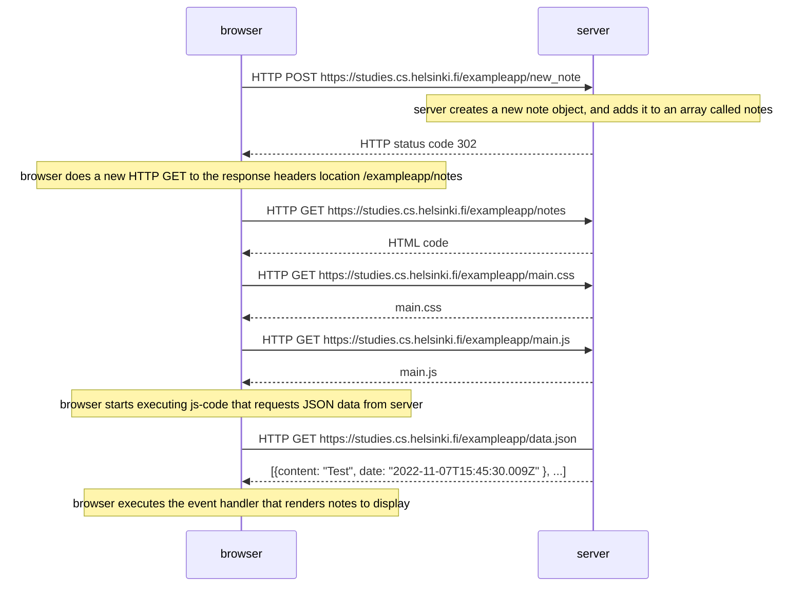

```mermaid
sequenceDiagram
browser->>server: HTTP POST https://studies.cs.helsinki.fi/exampleapp/new_note

note over server: server creates a new note object, and adds it to an array called notes
server-->>browser: HTTP status code 302

note over browser: browser does a new HTTP GET to the response headers location /exampleapp/notes

browser->>server: HTTP GET https://studies.cs.helsinki.fi/exampleapp/notes
server-->>browser: HTML code
browser->>server: HTTP GET https://studies.cs.helsinki.fi/exampleapp/main.css
server-->>browser: main.css
browser->>server: HTTP GET https://studies.cs.helsinki.fi/exampleapp/main.js
server-->>browser: main.js

note over browser: browser starts executing js-code that requests JSON data from server 

browser->server: HTTP GET https://studies.cs.helsinki.fi/exampleapp/data.json
server-->>browser: [{content: "Test", date: "2022-11-07T15:45:30.009Z" }, ...]

note over browser: browser executes the event handler that renders notes to display
```
